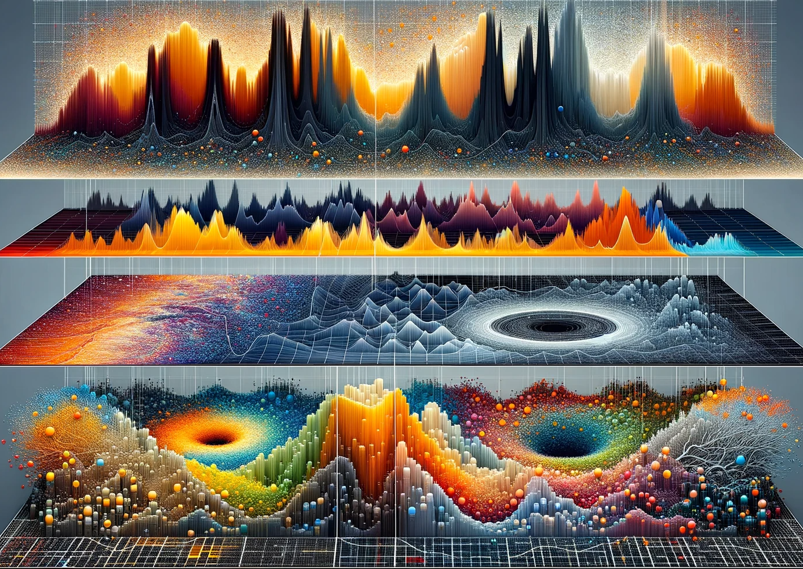
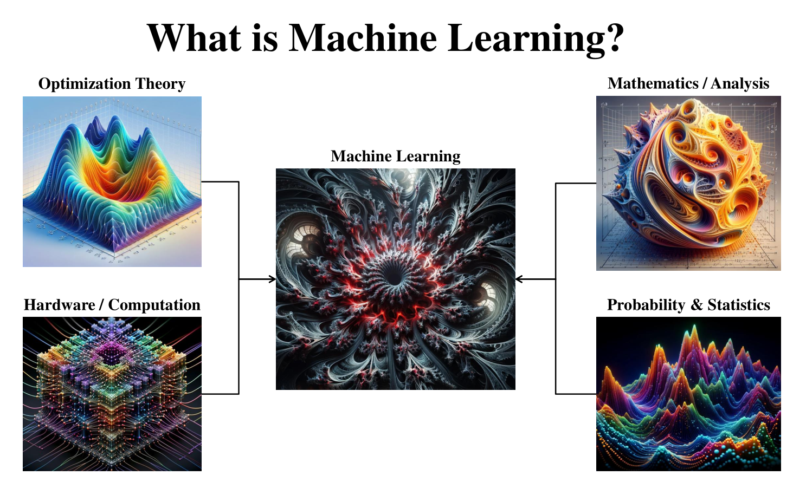
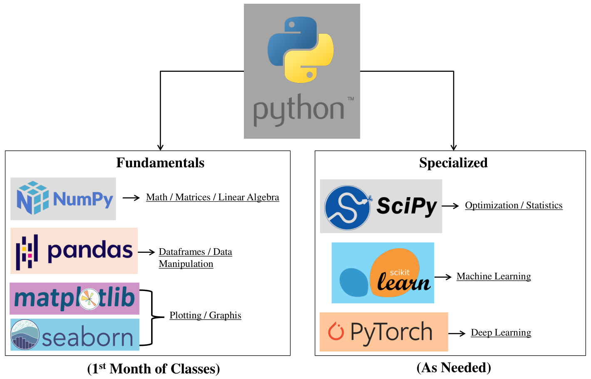

# Introduction to Machine Learning

Welcome! This repository encapsulates all materials that I created for the course ISE-364 / 464, titled "Introduction to Machine Learning". This includes all original lecture slides as well as homework assignments, projects, and the placement exam accompanying the course.

I originally built this course and taught it in the Fall 2024 semester at Lehigh University in the Industrial and Systems Engineering (ISE) Department. Two sections of this course were taught in tandem: a 364 section (for senior undergraduate students) and a 464 section (for graduate students).
As such, the lecture material remains the same for both sections, but the graduate section is simply augmented to have more difficult problems in the homework assignments. It also bears mentioning that this course was originally delivered over and designed for a 16 week period (4 months).

The material herein can be used in a variety of university, industrial, or recreational settings: to teach a university or industry-oriented introductory course on machine learning (ML), to serve as a comprehensive reference source for the fundamentals of the field of ML, or even topic-specific seminars (as the lectures are broken down by topic and are relatively independent from each other; although some notation is introduced in earlier lectures and re-used in later ones).

I will maintain this repository and keep the material updated if any edits are required. Further, I will continue to develop more advanced material for future education in more specialized topics (deep learning, data mining, statistics, optimization, other ML topics, etc.) which I will distinguish from the core course material as "special topics" or "advanced topics". I will also refine the content herein to be more complete if I find some topics lacking in depth.

Please send any comments or corrections to me at gdk220@lehigh.edu. Further, if you are a course instructor seeking complete solution write-ups for the homework assignments, again, please email me at the aforementioned address.

## Course Overview, General Outline, & Prerequisite Knowledge

Machine learning (ML) is the study and development of algorithms that learn patterns from data in
an automated way and is the bedrock of the field of artificial intelligence (AI). This is an introductory course in ML
designed for senior undergraduate, master, and doctoral students who have a working knowledge of Python
and sufficient knowledge in probability, statistics, multivariable calculus, and linear algebra. This course introduces
the core principles of ML, fundamental techniques & models, data mining methodology, and prepares for more
advanced study in ML. Emphasis will be placed on introducing ML models in an intuitive way from the
fundamental mathematical building blocks in order to gain a deep understanding of the assumptions preceding each
algorithm. The learning of these concepts will be facilitated with homework assignments that will consist of a
mixture of mathematical and coding problems (emphasis will be placed on the mathematics behind the algorithms and experience applying these models in practice).

### Topics Covered

The general outline of topics that are covered in this course can be split up into the 6 following categories (by topic):

- **Introduction and Review Material:** Introduction to the topic of ML. Reviews of mathematics, linear algebra, multivariate calculus, probability, and statistics. Introduction to the fundamentals of numerical optimization.

- **Supervised Learning (Discriminative Models):** Topics span linear regression, logistic regression, K-nearest neighbors, decision trees, ensemble methods, support vector machines (SVM), and artificial neural networks.

- **Supervised Learning (Generative Models):** Topics span Gaussian discriminative analysis (GDA) and naive Bayes (to be added in the future).

- **Unsupervised Learning:** Topics span K-means clustering and Gaussian mixture models.

- **Dimensionality Reduction:** Topics span principal component analysis (PCA) and linear discriminant analysis (LDA) (to be added in the future).

- **Data Mining Fundamentals:** Topics span the general procedure and workflow of the entire data mining process. This includes feature engineering, data cleaning, handling different types of data, feature encoding, model selection, cross-validation, and hyperparameter tuning.

### General Timeline

A rough timeframe to expect the material to cover in the order listed is as follows: (1/2 - 1 months) Intro and Review Material, (1 - 1.5 months) Discriminative Supervised Learning, (1 - 2 weeks) Generative Supervised Learning, (1 - 2 weeks) Unsupervised Learning, (1 - 2 weeks) Dimensionality Reduction, and (1 - 2 weeks) Data Mining Fundamentals. The amount of time dedicated to each topic can naturally be modified to cater to the goal of the instructor as well as the needs of the class (for example, taking more time in covering the review material if the class consists of mostly undergraduate students).

### Advanced Topics

Further, more advanced topics that may not fit within the original span of material covered by this course, but which is material that has been included in this repo (or will be uploaded in the future), and can be incorporated depending on the goals of the course are:

- **Deep Learning:** Topics could span convolutional neural networks, recurrent neural networks, long short-term memory (LSTM) neural networks, generative adversarial networks (GANs), transformers (encoder & decoder architectures), and neural architecture search (NAS).

- **Advanced Unsupervised Learning:** Topics could span DBSCAN (density-based spatial clustering of applications with noise) and spectral clustering.

- **Advanced Dimensionality Reduction:** Topics could span T-SNE (t-distributed stochastic neighbor embeddings) and UMAP (uniform manifold approximation & projection).

- **Reinforcement Learning:** Topics could span Markov decision processes, policies & value functions, dynamic programming, Monte Carlo methods, temporal difference methods, and Q-learning.

## Coding Competencies Overview

As this is an introductory machine learning course, it is customary to incorporate a healthy amount of coding material to facilitate understanding and maximize learning outcomes by hands-on practice with algorithmic implementation or data mining. Naturally, Python is a first choice and is the language that is utilized in this class to aid in learning the material. Choosing Python as the language for this class has several benefits, some of which include: (1) Python is perhaps the most intuitive of the coding laguages as well as the most "required-to-know" languages, (2) access to powerful scientific computing, machine learning, and deep learning (DL) libraries (such as Numpy, Scikit-Learn, Scipy, and PyTorch), (3) students will get experience with the most-used libraries for data mining and machine learning, (4) Pytorch is perhaps the most-used DL library for doing research and implementing modern-day advanced (and custom) ML and DL models.

This course is structured in a way where students are not required to have prior experience coding with Python (though it would be beneficial) as the first month or so is designed to include introductory material for each of the fundamental Python libraries: Numpy, Pandas, Matplotlib, and Seaborn. However, students are expected to have some coding experience before taking this course. This will aid in making the process of picking up the Python syntax more streamlined and will help cut down on the likelihood of students falling behind.

The first month or so of classes is designed to be covering review material in calculus, linear algebra, probability & statistics, and fundamentals of optimization. As such, each of the first four weeks of classes has been sructured to have an assignment in python associated with them to help bring the students up to speed and familiarity with the fundamental libraries that will be used: week 1 covers the funamentals of Python, week 2 covers the fundamentals of Numpy, week 3 covers the fundamentals of Pandas, and week 4 covers the fundamentals of Matplotlib and Seaborn. All of the material for these first 4 weeks of coding can be found in the "Coding Material" folder, where students can use the Jupyter notebooks in the "Coding_Fundamentals_References" folder to review the material necessary to write code for the corresponding coding assignments that can be found in "Coding_Fundamentals_Assignments". These introductory Jupyter notebooks for the fundamentals of Python coding are curtesy of Professor Louis Plebani. This structure allows the students to come up to speed on the coding fundamentals necessary for the class without the instructor having to explicitely take time out of the semester to teach the basics of Python; further, the instructor can instead focus on reviewing the typically more-difficult mathematical pre-requisite material.

A list of the main Python libraries that students will need is as follows:
- Numpy
- Pandas
- Matploplib & Seaborn
- Scipy
- Scikit-Learn
- PyTorch

Further, if students already have Python set-up on their computers and are confident in their ability to use it, that is fine. Otherwise, I strongly recommend setting up Python through Anaconda as it will be very easy to download all libraries that will be needed throughout the semester.

## Homework, Final Project, & Final Interview

The workload in this course is designed with the hope to best facilitate deep understanding and confidence with foundational topics in machine learning, which will ultimately be required for any further work in industry or advanced research. Understanding the fundamentals is key to performing well in any field.

### Homework

There are a total of 7 homework assignments that I made for this course and which were designed to be assigned once every two weeks in consecutive order. The first assignment should be given two weeks after the start of the course such that enough material can be covered for the first assignment. Then, following the two week schedule, the final assignment would be collected at the end of the 16th week.

The content of the homework assignments mostly consist of mathematical questions, theoretical proofs, by-hand computations with ML models, as well as some concept questions and coding questions. The assignments are designed to allow students to hone their mathematical and coding skills, while solidifying conceptual understanding and demystifying what is going on under-the-hood in ML algorithms. Some of the problems were inspired and distilled from courses that I experienced throughout my academic career.

### Final Project

There is a final project for this course that allows students to work in either a team or individual setting to solve a data mining problem. This assignment should be given near the start of the final month of classes and the students should have about 4 weeks to complete it. This involves fully analyzing a dataset, building the best ML model to predict some target variable, and then deliver a thorough write-up (research paper style) of their methodology, findings, and reasoning. The dataset that is used for this project is a modified version of a well-known, public, competitive housing price prediction dataset (see license for accreditation).

### Final Interview

There is no final "test" per say for this course (mostly because I do not believe that evaluating someones understanding of ML concepts is best achieved in a sit-down timed exam). However, I do think that one of the surest ways to evaluate the level of understanding someone has of these concepts is by having a face-to-face conversation with them "interview" stlye and ask them a series of conceptual questions. This benefits students in two ways: (1) it requires them to zoom out of the nitty-gritty mathematics of the homework assignments and grasp the over-arching concepts tying everything together (the how and why of ML) and (2) it prepares them for the real-life job market and in-depth interviews they will have to go through.

In order to make the interviewing process fair for all students and ensure that later-interviewed students do not receive an unfair advantage from hearing what questions were asked to the earlier sudents, I have prepared a document with a test question bank that should be accessable to all students. All possible interview questions will be drawn from this document. Thus, all students will have the same amount of knowledge on what to expect, and the only way to be prepared is for them to study.

The final intervews themselves consisted of a series of 5 randomly drawn questions from the test bank (sub-divided into 3 categories: 2 "easy" questions, 2 "medium" questions, and 1 "hard" question) and were delivered over a 10-minute long interview (approximatey 2 minutes per question).

## Datasets

This repository includes two datasets from Kaggle, both of which permit academic & educational use. Please see the LICENSE file for a full list of the datasets and their license terms. Further, please ensure your use of the datasets complies with Kaggle’s licensing terms and conditions. (See LICENSE)

## Citation

If you find this repository useful and end up using it in your research or teaching, please feel free to cite it as the following:

Kent, G. D. (2024). *Introduction to Machine Learning* (v1.0.0). Zenodo. [https://doi.org/10.5281/zenodo.14509596](https://zenodo.org/records/14509596).

### General Disclaimer

The vast majority of images, diagrams, plots, and figures used in the lecture slides were created by myself or generated by me via DALLE. However, some images used in the lecture slides were sourced from web searches for educational purposes only. All efforts were made to use images that fall under fair use or public domain (such as Unsplash, wikimedia commons, etc.), and most are cited in reference slides (or the slide the content appears on) for those that could be identified. If you believe an image has been used improperly or is missing a known citation, please contact me, and it will be promptly removed, replaced, edited, or updated with the relevant information.

## License
(See LICENSE) This repository is licensed under the **Creative Commons Attribution-ShareAlike 4.0 International (CC BY-SA 4.0)** license.

- **What this means**: You are free to share and adapt these materials, even for commercial purposes, as long as you:
  - Attribute the original work appropriately.
  - Share any derivative works under the same license.
- For more information, see the full license text at [CC BY-SA 4.0](https://creativecommons.org/licenses/by-sa/4.0/).

